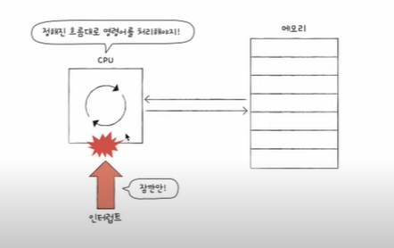

### 명령어 사이클과 인터럽트

### 명령어 사이클

- 프로그램 속 명령어들은 일정한 주기가 반복되며 실행
- 이 주기를 명령어 사이클이라고 함

- 인출 사이클
  - 가장 먼저 CPU로 갖고 와야 한다.

- 실행 사이클
  - 갖고 왔으면 실행해야 한다.

사이클은 인출 - 실행 - 인출 실행 을 반복한다.

그런데 CPU로 명령어를 가지고 와도 바로 실행이 불가능한 경우도 있다.

- 간접 주소 데이터

- 어떤 명령어는 인출과 실행 사이클만으로 실행되고, 어떤 명령어는 인출, 간접, 실행 사이클을 거쳐 실행된다.

인터럽트는 이렇게 정해진 흐름을 끊는것이다.

- CPU가 꼭 주목해야할 때, CPU가 얼른 처리해야 할 다른 작업이 생겼을때 발생

- 동기 인터럽트(예외)

  - CPU가 예기치 못한 상황을 접했을때 발생

    

- 비동기 인터럽트(하드웨어 인터럽트)
  - 주로 입출력장치에 의해 발생
  - 알림(세탁기 완료 알림 ..)과 같은 역할

- **입출력 작업 도중에도 효율적으로 명령어를 처리** 하기 위해 하드웨어 인터럽트 사용
- 입출력장치는 CPU에 비해 느리다.
- 인터럽트가 없다면 CPU는 프린트 완료 여부를 확인하기 위해 주기적으로 확인해야 한다.

하드웨어 인터럽트의 처리 순서

- 인터럽트의 종류를 막론하고 인터럽트 처리 순서는 대동소이하다.

- 인터럽트 요청신호

  

- CPU가 인터럽트 요청을 받아들이려면? - 인터럽트 플래그
  - 모든 인터럽트를 인터럽트 플래그로 막을 수 있는건 아니다.
  - 막을 수 있는 인터럽트(maskable interrupt)
     - 막을 수 없는 인터럽트(non maskable interrupt)

  

- 인터럽트 서비스 루틴

  - CPU가 인터럽트를 받아들이기로 했다면 인터럽트 서비스 루틴 실행

  - 인터럽트가 발생했을 때 해당 인터럽트를 어떻게 처리하기 위한 프로그램
  - 키보드가 인터럽트 요청을 보내면 이렇게 행동해야 한다~

  - 인터럽트 서비스 루틴도 프로그램이기에 메모리에 저장

- 인터럽트 벡터

  - 각각의 인터럽트를 구분하기 위한 정보

  

CPU가 인터럽트를 처리한다.

== '인터럽트 서비스 루틴을 실행하고, 본래 수행하던 작업으로 다시 되돌아온다.'

(+ 그리고 인터럽트의 시작 주소는 인터럽트 벡터를 통해 알 수 있다.)

