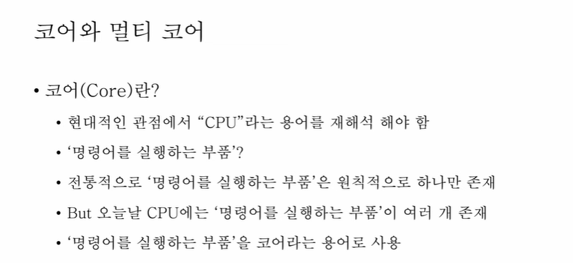
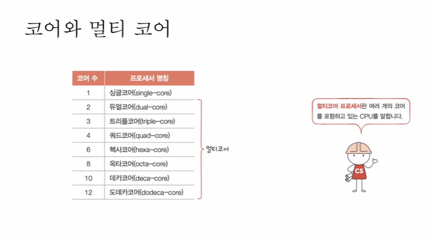

### 12강. 빠른 CPU를 위한 설계 기법

1. 컴퓨터 부품들은 '클럭 신호'에 맞춰 일사불란하게 움직인다.
2. CPU는 '명령어 사이클'이라는 정해진 흐름에 맞춰 명령어들을 실행한다.

클럭속도

- 헤르츠(Hz) 단위로 측정
- 헤르츠(Hz) : 1초에 클럭이 반복되는 횟수

클럭속도를 늘리면 CPU가 빨라지긴 한다. 하지만 무한정 늘릴수는 없다. 그러면 CPU 발열이 심해지기 때문에

클럭 속도 를 늘리는 방법 이외에는

- 코어 수를 늘리는 방법(듀얼 코어, 멀티 코어...)
- 스레드 수를 늘리는 방법(멀티 스레드...)

꼭 코어 수에 비례하여 증가하지는 않는다.

스레드란 '실행 흐름의 단위'

하드웨어 스레드 : 하나의 코어가 동시에 처리하는 명령어 단위

멀티 스레드 프로세서, 멀티스레드 CPU

1코어 1스레드 CPU도 여러 소프트웨어적 스레드를 만들 수 있다.

멀티스레드 프로세서를 실제로 설계하는 일은 매우 복잡하지만, 가장 큰 핵심은 레지스터

